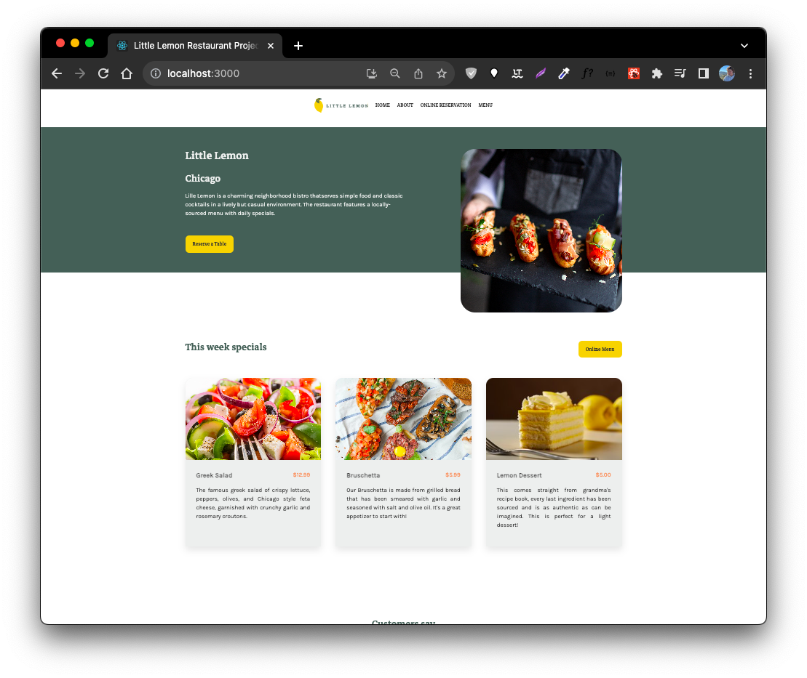
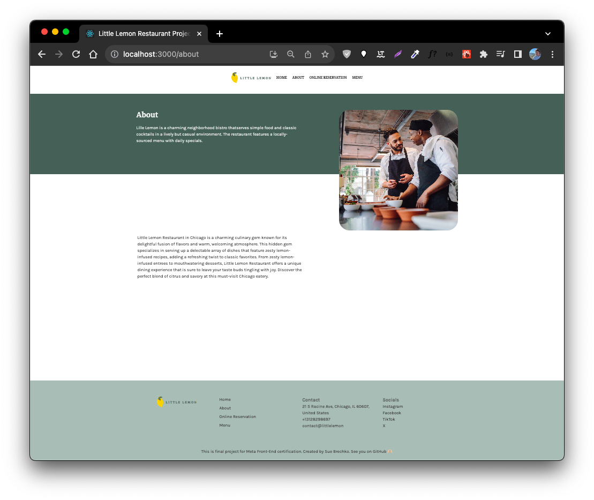
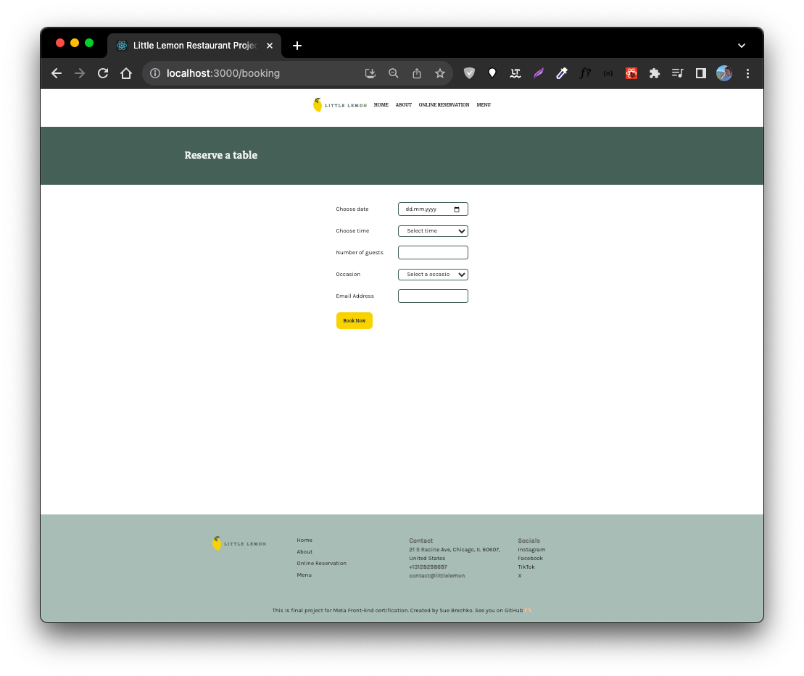
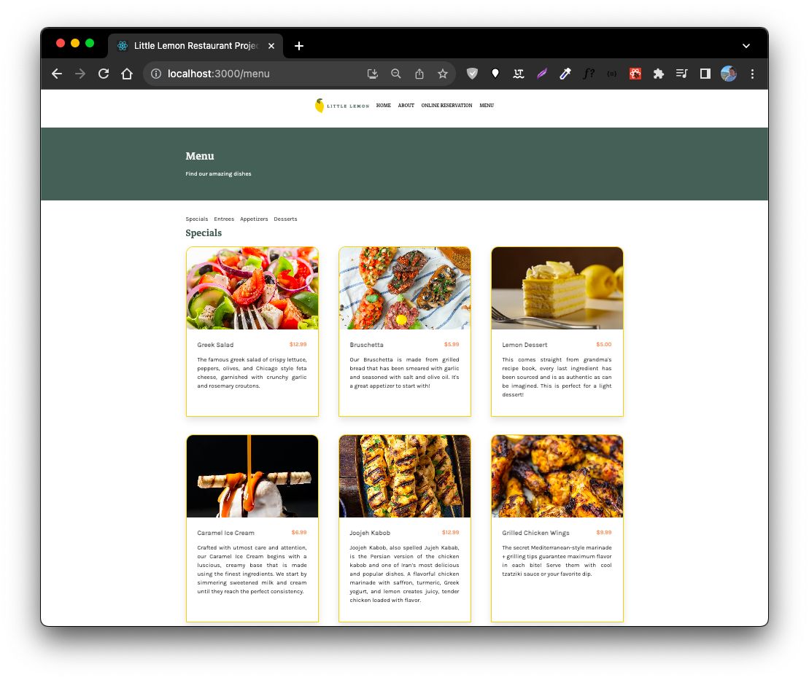

# Meta Front End certification - final project assessment

This is a solution to the [Meta Front-End developer capstone](https://www.coursera.org/learn/meta-front-end-developer-capstone/).

## Table of contents

- [Overview](#overview)
  - [About the final project assessment](#the-challenge)
  - [Screenshot](#screenshot)
  - [Links](#links)
- [My process](#my-process)
  - [Built with](#built-with)
  - [Continued development](#continued-development)
  - [Useful resources](#useful-resources)
- [Author](#author)

## Overview

### About the final project assessment

In the project, React skills were utilized to build a web app for Little Lemon restaurant, emphasizing UX/UI, design adherence, accessibility tags, and a functional booking form with robust validation. The entire project was committed to a Git repository, showcasing version control skills for collaboration and revision tracking. This project underscores technical competence in React and dedication to delivering high-quality, accessible, and functional web applications.

### Screenshot

### Links

- Live Site URL: (https://sue-little-lemon-meta.netlify.app/)

## My process

### Built with

- Semantic HTML5 markup
- CSS custom properties
- Flexbox
- Bootstrap
- [React](https://reactjs.org/) - JS library

### Continued development

- Add online order feature
- Add Login and user account feature
- User history reservations&orders

### Useful resources

- [Hash link](https://www.npmjs.com/package/react-router-hash-link) - Help create a smoothly scroll to the element.
- [Restaurant API](https://little-lemon-restaurant-database.onrender.com/) - Here is the API with all data for the project.
- [Formik](https://formik.org/docs/tutorial) - Library that provides easy way to build and validate forms.

## Author

- Twitter - [@suereact](https://www.twitter.com/suereact)
